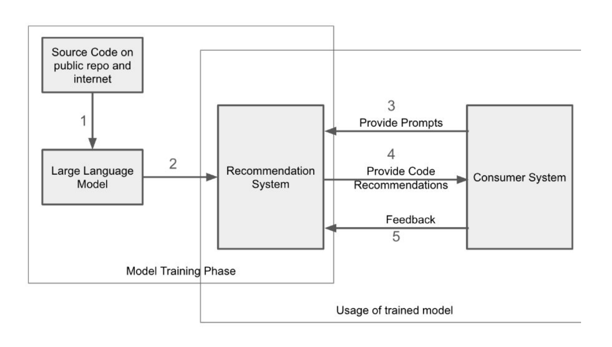

# 1 Letter of Transmittal

Bryce Lasson 
436 Stadium Ave BSMT 
Provo, UT 84604

March 14, 2026

Dr. David Wood 
Team Leader, EYARC Lab at BYU 
332 Campus Dr 
Provo, UT, 84604

Dear Dr. David Wood,

I am pleased to submit my recommendation report, ***Stabilizing Speed: A Software Design Framework for AI-Assisted Development on the EYARC Experience Team***, for your review. I wrote this report to support planning for how our team should use AI in a way that improves development speed without creating more long-term maintenance problems. The report explains the main causes of our current instability, examines three possible paths forward, and recommends a phased approach built around a lightweight design framework.

My recommendation is that our team adopt a framework with clear design rules, prompt guidance, and human-first review, while treating multi-agent verification as a longer-term direction. I believe this approach best fits our team’s needs because it supports both speed and code quality in our student-driven development environment.

Thank you for your time and consideration. I hope you find this report useful as you evaluate how our team should move forward.

Sincerely, 
<picture><source media="(prefers-color-scheme: dark)" srcset="./01_letter_of_transmittal/Signature-White.png"><source media="(prefers-color-scheme: light)" srcset="./01_letter_of_transmittal/Signature-Black.png"></picture> 
Bryce Lasson

Enclosure: *Stabilizing Speed: A Software Design Framework for AI-Assisted Development on the EYARC Experience Team*

# 2 Title Page
### Stabilizing Speed: A Software Design Framework for AI-Assisted Development on the EYARC Experience Team

Bryce Lasson

Department of Computer Science, Brigham Young University

WRTG 316: Technical Communication

Dr. Nicole Clawson

March 14, 2026

# 3 Executive Summary

Our team is moving fast with AI-assisted development. AI helps us write code quickly, but we do not have a shared system for how that code should be structured, reviewed, or matched to the rest of our app. Because of that, time saved early can be lost later through debugging, refactoring, and dependency problems. Research supports that risk. Tartaglia reports that experienced developers on familiar codebases took 19% longer when AI suggestions required extra review, validation, and debugging. Sculley et al. also warn that quick wins in complex systems often create long-term maintenance costs when structure is weak. Our team has seen these quick wins, time losses, and weak structure, evident in our prior database refactors, but we have another factor contributing to our situation.

Everyone on our team is currently a student, so we also deal with the challenges that come with student turnover and varying experience levels. Research on student programmers shows that AI can help students produce code with fewer errors and lower complexity, but the final work still reflects both AI output and student revision (Haindl & Weinberger, 2024). Part of this problem is that our team does not always fully understand the code AI generates. Our weak structure may also be due to a lack of thorough review. Research on automation bias shows that people can favor automated recommendations too quickly, especially when the workflow does not require active human judgment before seeing AI output (Romeo & Conti, 2026). Put together, these student risks suggest that our problem is not AI alone, but the lack of a shared process for how we use it. The next step is to decide how our team should move forward.

I considered three options. The first is to continue using AI without shared constraints. The second option is to create an integrated software design framework that uses software design patterns, prompt templates, and human-first review. The third option is to move toward a custom multi-agent lifecycle model. I'd recommend a phased approach built from two of the three options. I recommend adopting a design framework now that uses clear design rules, a small prompt-template library built from strong internal examples, and a human-first review process. Then, as our needs grow, we can build toward a multi-agent model. I believe this approach will give us the best chance of keeping the benefits of AI without letting our codebase get harder to maintain each semester.

# 4 Introduction

The EYARC Experience Team uses AI because it helps us move faster. But that speed has come with a cost. In our current workflow, AI-generated code has introduced bugs, weak structure, and technical debt that requires constant upkeep. We have seen this in our own work when quick solutions later turned into refactors, dependency issues, and extra review time. What looks fast at the start does not always stay fast once that code has to be maintained, extended, or understood by a new group of students.

This issue matters even more because our team is built around student developers. Students graduate, move on, and join at different skill levels, so the codebase has to survive constant turnover. That makes consistency especially important. If our structure is weak, new students have a harder time understanding old code, and small problems are more likely to grow into bigger ones. AI can help us work faster, but on a student team like ours, speed without shared rules can make the problem worse instead of better.

Because of that, I am proposing a framework built around what I call "Stabilizing Speed". By that, I mean creating a framework with clear rules that help students and AI work together to improve both production speed and code quality. My report argues that our team needs a framework so we can keep moving quickly without creating more long-term maintenance problems.

This report first explains the problem by looking at technical debt, student turnover and skill gaps, system fragility, and automation bias. It then examines three options: continuing with unconstrained AI assistance, adopting an integrated software design framework, or moving toward a custom multi-agent lifecycle model. It closes by recommending a phased plan that starts with the design framework and treats multi-agent verification as a future direction.

# 5 Problem Description
## 5.1 Technical Debt and Skill Gaps

The EYARC Experience Team is moving faster with AI, but that speed is also creating more bugs and more maintenance problems. The main issue is not AI alone. The issue is that our team does not have a shared process for how AI-generated code should be structured, reviewed, and maintained. This section explains how student turnover, skill gaps, and weak coding rules are causing that problem.

One big reason we are struggling is because our team is mostly students, which comes with two main problems. The first is a high employee turnover rate. This turnover rate creates a "gap" in what we know about our work and platform since the people who wrote the code aren't around. The second is that many of us are still learning the basics of software design while trying to maintain our team's main web app. Because we are still gaining experience, it is very hard to keep the code consistent when the team changes so often and we don't have a standard set of rules to follow. These human factors create a fragile foundation that makes technical problems even worse.

This lack of experience among our team members often leads us to rely heavily on AI tools like Antigravity and Codex, but using these tools without a plan can be highly time consuming in the long run. Right now, a lot of our development time is spent fixing mistakes or rewriting code from old features instead of building new things. This suggests that without a clear structure, the time we "save" with AI at the start is just being lost later when the code breaks. If we don't create a real plan for how we use AI together as a team, we could keep spending more time fixing bugs than actually finishing projects.

## 5.2 Technical Root Causes

The way we build our main web app might be causing bugs as it gets bigger. Without a set of rules for the AI to follow, the results often focus on just getting the job done right now instead of thinking about how the code will look in a year. Research suggests that these problems may be connected. Supekar and Khande (2024) show that when teams do not use design patterns, they may create more technical debt and maintenance problems over time. Sergeyuk et al. (2025) also suggest that AI-generated code can include logic and consistency problems. Taken together, these sources seem to support what we have been seeing on our team: code that looks helpful at first may become harder to maintain later. A prime example of this was the `course_assignment_settings_form` that we developed recently. Multiple students were working on it using AI, and because we didn't have a set plan, it ended up with an inconsistent structure and caused a lot of errors. Now, our team is spending time refactoring it rather than working on new assignments.

Another issue is how AI code can accidentally mess up other parts of our system without us realizing it. This is often called the "Changing Anything Changes Everything" principle—a concept originally describing machine learning systems that can also apply to our software architecture (Sculley et al., 2015). This can make the whole app feel fragile because one small change might cause a bug in a completely different spot. I have seen this happen in our own app: it is currently causing issues between our database and our Auditing Inventory Simulation. This demonstrates a big gap between the architecture we want and the actual code the AI writes for us. Many times, the AI creates logic that lacks basic structural integrity, such as failing to check for variable consistency or making the code difficult to follow (Sergeyuk et al., 2025). These "gaps" in the AI's logic mean that we have to be the ones to provide the structure, or the system will continue to erode as we add more features.

## 5.3 Behavioral Root Causes

Our problems aren't just technical; they are also about how we think when we use AI tools. We have also fallen into habits that make mistakes harder to catch, including automation bias. Romeo and Conti define automation bias as a tendency to favor automated recommendations even when contradictory or more accurate information is available (Romeo & Conti, 2026). I've seen myself and other students merge code they don't fully understand because they think the AI knows more than they do. This is a big problem because it lets bugs into our main branch that could have been caught if we were paying more attention. When we stop questioning the output, we stop acting like engineers and start acting like copy-pasters. This also ties into trusting AI too much in other matters.

It is also very easy to let the AI handle the hard parts of coding, but this can backfire without a plan to double-check the results. We often think we are moving faster, but spending hours debugging AI mistakes can take more time than just writing it ourselves. Research in enterprise settings shows that experienced developers can take up to 19% longer to finish tasks with AI because they have to fix so many errors (Tartaglia, 2025). For students like us who are still learning, that number is likely even higher because we don't always have the background to fix what the AI broke. We should not let the instant nature of AI fool us into thinking we are being productive without a plan to keep our code organized.

In the end, the bugs and long-term problems we are seeing at the EYARC Experience Team come from combining powerful AI tools with a student team that doesn't have a consistent set of rules to follow. I think we should stop relying on "fast and flimsy" results and start using a framework that keeps our code clean and reliable as students come and go, and as our use of AI continues to grow. These behavioral habits are just as dangerous as the technical ones, and they must be addressed together. Because both our technical structure and our team behavior contribute to this instability, any solution must address both.

# 6 Options and Potential Solutions

To help fix the issues we are having with buggy code and long-term instability, I have researched three main options. We can keep doing things the way we are now, we can start using a software design framework, or we can explore a multi-agent lifecycle model.

## Option A: Unconstrained AI Assistance

Right now, everyone at the EYARC Experience Team just uses AI however they want without any specific rules. This is easy to start with because we don't have to learn any new systems, but it is causing a lot of problems as our main web app gets older.

The main issue is that while writing code is fast at first, the app becomes unstable because the AI doesn't know our overall design. This causes a knowledge gap where the code becomes much harder to manage as students graduate. Research on "technical debt" shows that when code is built without a plan, we spend more time trying to understand and fix old mistakes than we do building new features (Tartaglia, 2025). This is exactly what we are seeing on the EYARC Experience Team. I believe that if we stay on this path, our code could become so messy that our AI usage eventually stops being productive, or even more time consuming than coding on our own.

## Option B: Integrated Software Design Framework

I believe one strong option is to build a framework that requires the AI to follow certain design rules. This plan focuses on three key areas: using structural rules for the code, setting up prompt templates, and making sure humans stay in charge of the final decisions.

### Structural SOLID Principles

First, we should ensure our code follows the SOLID principles, a set of five rules that keep software from becoming harder to maintain over time (Yanakiev et al., 2025). I won't dive into all of them, but the core principle our team struggles the most with is the Dependency Inversion Principle (DIP). The DIP states that our high-level logic should stay separate from the low-level tools we use. This keeps different parts of the code from being too tangled up. To better illustrate the DIP, let's dive into an example.

Think of our code like a TV and its remote. If the remote is built to only work with one specific TV, you have to buy a new remote the moment the TV breaks. But if the remote is built to work with a TV interface, it can control any TV regardless of the brand. When our code is tangled, it's like having a remote glued to one TV. For example, if we change how we store data in our database, we might have to rewrite an entire assignment or simulation to work with it. By using an abstraction, we can change the low-level tools (the TV), without breaking the high-level logic (how to change a channel remotely). That's the Dependency Inversion Principle in practice. It would make a large difference for our team because then students know exactly where to go based on dependencies. And that's just the start of structured design.

Other research also supports the value of structured design. In an ASML refactoring effort centered on SOLID principles, particularly Dependency Inversion, researchers reported removing 50% of illegal dependencies and reducing illegally used exported symbols by more than 85% across more than 5,000 files (Yanakiev et al., 2025). Separate work from Peking University found that a multi-agent code-generation approach that explicitly incorporated design patterns improved dynamic maintainability metrics by more than 60% under changing requirements (Wang et al., 2025).

### Prompt Templates

Next, we can improve how we talk to the AI by using specific templates for our prompts. A practical option is to give the AI selected examples of strong internal code and reusable prompts. Nashid et al. show that few-shot prompting with relevant retrieved code examples can substantially improve code-task performance, while Tartaglia argues that project-specific context helps AI tools align better with an existing codebase and reduces avoidable rework. Together, those findings support a lightweight prompt library as a reasonable intermediate step before a heavier retrieval system.

Next, we can improve how we talk to the AI by using specific templates for our prompts. A practical option is to give the AI selected examples of strong internal code and reusable prompts. Nashid et al. show that few-shot prompting with relevant retrieved code examples can substantially improve code-task performance, while Tartaglia argues that project-specific context helps AI tools align better with an existing codebase and reduces avoidable rework. Together, those findings support a lightweight prompt library as a reasonable intermediate step before a heavier retrieval system.For example, see Figure 1 for how prompts and code examples could be used together in an AI-driven recommendation workflow.

**Figure 1** 
AI Driven Design Pattern Recommendation System

 

_Note._ This figure outlines the workflow of an AI-driven recommendation system that uses prompts and code examples to suggest relevant design patterns. Taken from Improving Software Engineering Practices: AI-Driven Adoption of Design Patterns, by V. Supekar and R. Khande, 2024 (pp. 772).

### Human Oversight

Lastly, we need to make sure we don't just blindly trust what the AI tells us. Experts suggest building "friction" into our workflow to make sure humans stay involved (Romeo & Conti, 2026). Our team may need more deliberate "friction" by having a set review process when using AI. Instead of relying on AI by default, we could require students to think through the task first and review AI output more carefully before code is merged (Romeo & Conti, 2026; Esposito et al., 2026). This forces us as employees to actually understand the problem we are solving instead of just letting the AI guess for us. It keeps us in control and helps us become better engineers as we gain experience.

## Option C: Custom Multi-Agent Lifecycle Model

Recent work on multi-agent development suggests a possible long-term path for our team. Instead of relying on one AI model to do everything, a multi-agent approach splits the work across multiple roles, such as planning, coding, reviewing, and refining. Wang et al. (2025) found that this kind of structured workflow can improve maintainability under changing requirements because each stage is checked before the process moves forward. That makes it useful for catching logical gaps or weak design decisions that a one-shot AI workflow might miss. This option would take more time and effort to build than the others, so I do not think it is the best first step for our team. However, it could become a strong long-term direction once we have a more consistent design framework in place.

## Summary of Options

Figure 2 summarizes the tradeoffs between the three options. These ratings are based on my experience managing projects on the EYARC Experience Team and on the way our team already estimates development time and effort. Based on that comparison, I believe that a combination of Options B and C represents the best path forward. By using design patterns to keep our code organized and review rules to maintain responsibility, I think we can keep the benefits of AI without the constant bugs that keep slowing us down. Given the strengths and tradeoffs of each option, I've created a recommendation for our team going forward.

**Figure 2** 
Comparison of Recommendation Options

| Feature | Option A: Unconstrained AI Assistance | Option B: Design Framework | Option C: Multi-Agent Model |
| :------------------------- | :-------------------------- | :------------------------- | :-------------------------- |
| **Initial delivery speed** | N/A | High | Moderate |
| **Long-term maintainability** | Low | High | Very High |
| **Time spent fixing existing code** | High | High initially, Low over time | Low |
| **Learning curve after implementation** | N/A | Moderate | High |
| **Value over time** | Low over time | Moderate | Very High |

_Note._ These ratings are based on my experience managing projects on the EYARC Experience Team and on our current reporting guidelines. They are intended to compare the practical tradeoffs of each option in our team environment.

# 7 Conclusion and Implementation Recommendation

The EYARC Experience Team has a clear opportunity to reduce bugs and long-term instability by changing how we use AI. While writing code quickly is a benefit, we cannot ignore the long-term cost of flimsy, unorganized software. I recommend adopting a "Stabilizing Speed" framework built first on clear design rules, prompt guidance, and human-first review. This approach can help our team preserve the speed benefits of AI while reducing the maintenance problems that keep slowing us down. Over time, that framework could expand toward multi-agent verification as the team’s needs grow.

## Why This Matters

This recommendation matters because speed only helps our team if it actually lasts. Research suggests that AI can save time in some cases, but those gains may shrink if our team spends too much time reviewing, debugging, and refactoring AI-generated code (Tartaglia, 2025). Research also shows that software design patterns from a shared framework can make code 60% easier to manage (Wang et al., 2025). If that structure reduces the amount of time we spend fixing bugs and reworking old code, then we can spend more time developing features that improve our platform. In that way, we can turn the false confidence AI gives us into real productivity.

## Action Plan: Phased Implementation

To begin moving from our current workflow toward this framework, I recommend three immediate steps:

1. **Create a Design Pattern Guide:** We should formally write down the coding rules we want everyone to follow, such as the Dependency Inversion Principle. This should include choosing a standard UI architecture and identifying the core design patterns we want students and AI to use consistently. That guide would become the foundation for how our team structures code going forward.

2. **Develop a Prompt Library:** We should build a small library of proven prompt blueprints using strong internal code examples and a few-shot approach. This will help us avoid repeating the same AI mistakes and make it easier for AI-generated code to match the patterns our team already wants to follow.

3. **Use Human-First Reviews:** We should change our workflow so students write their own plans or tests before using AI tools, as suggested by Romeo and Conti (2026). This keeps students involved in the thinking process, helps them better understand the code they are working with, and makes it easier to catch mistakes before they reach our users.

These steps are not meant to slow our team down. They are meant to give us a clearer system for using AI so we can build better software with less rework over time.

# 8 References

<b>References</b>

Callstack. (2026, January 16). <em>Announcing: React Native best practices for AI agents</em>. <em>Callstack Blog</em>. <a href="https://www.callstack.com/blog/announcing-react-native-best-practices-for-ai-agents">https://www.callstack.com/blog/announcing-react-native-best-practices-for-ai-agents</a>

Esposito, M., Li, X., Moreschini, S., Ahmad, N., Cerny, T., Vaidhyanathan, K., Lenarduzzi, V., &amp; Taibi, D. (2025). <em>Generative AI for software architecture: Applications, challenges, and future directions</em>. <em>Journal of Systems and Software, 231</em>, 112607. <a href="https://doi.org/10.1016/j.jss.2025.112607">https://doi.org/10.1016/j.jss.2025.112607</a>

Haindl, P., &amp; Weinberger, G. (2024). <em>Does ChatGPT help novice programmers write better code? Results from static code analysis</em>. <em>IEEE Access, 12</em>, 114146–114156. <a href="https://doi.org/10.1109/ACCESS.2024.3445432">https://doi.org/10.1109/ACCESS.2024.3445432</a>

Nashid, N., Santaha, M., &amp; Mesbah, A. (2023). <em>Retrieval-based prompt selection for code-related few-shot learning</em>. In <em>Proceedings of the IEEE/ACM International Conference on Software Engineering (ICSE)</em>. <a href="https://people.ece.ubc.ca/amesbah/resources/papers/cedar-icse23.pdf">https://people.ece.ubc.ca/amesbah/resources/papers/cedar-icse23.pdf</a>

Romeo, G., &amp; Conti, D. (2026). <em>Exploring automation bias in human–AI collaboration: A review and implications for explainable AI</em>. <em>AI &amp; Society, 41</em>, 259–278. <a href="https://doi.org/10.1007/s00146-025-02422-7">https://doi.org/10.1007/s00146-025-02422-7</a>

Sculley, D., Holt, G., Golovin, D., Davydov, E., Phillips, T., Ebner, D., Chaudhary, V., Young, M., Crespo, J.-F., &amp; Dennison, D. (2015). <em>Hidden technical debt in machine learning systems</em>. In <em>Advances in Neural Information Processing Systems</em>. <a href="https://proceedings.neurips.cc/paper/2015/file/86df7dcfd896fcaf2674f757a2463eba-Paper.pdf">https://proceedings.neurips.cc/paper/2015/file/86df7dcfd896fcaf2674f757a2463eba-Paper.pdf</a>

Sergeyuk, A., Golubev, Y., Bryksin, T., &amp; Ahmed, I. (2025). <em>Using AI-based coding assistants in practice: State of affairs, perceptions, and ways forward</em>. <em>Information and Software Technology</em>. <a href="https://doi.org/10.1016/j.infsof.2024.107565">https://doi.org/10.1016/j.infsof.2024.107565</a>

Supekar, V., &amp; Khande, R. (2024). <em>Improving software engineering practices: AI-driven adoption of design patterns</em>. In <em>2024 Second International Conference on Advanced Computing &amp; Communication Technologies (ICACCTech)</em> (pp. 768–774). IEEE. <a href="https://doi.org/10.1109/ICACCTech65084.2024.00128">https://doi.org/10.1109/ICACCTech65084.2024.00128</a>

Tartaglia, R. (2025). <em>The ROI of AI in coding development: What teams need to know in 2025</em>. <em>Medium</em>. <a href="https://medium.com/@rtartaglia/the-roi-of-ai-in-coding-development-what-teams-need-to-know-in-2025-8e3c3e8e3c3e">https://medium.com/@rtartaglia/the-roi-of-ai-in-coding-development-what-teams-need-to-know-in-2025-8e3c3e8e3c3e</a>

Wang, Z., Ling, R., Wang, C., Yu, Y., Li, Z., Xiong, F., &amp; Zhang, W. (2025). <em>MaintainCoder: Maintainable code generation under dynamic requirements</em>. In <em>NeurIPS 2025 (Poster)</em>. <a href="https://neurips.cc/virtual/2025/poster/117862">https://neurips.cc/virtual/2025/poster/117862</a>

Yanakiev, I., Lazar, B.-M., &amp; Capiluppi, A. (2025). <em>Applying SOLID principles for the refactoring of legacy code: An experience report</em>. <em>Journal of Systems and Software</em>. <a href="https://doi.org/10.1016/j.jss.2024.112254">https://doi.org/10.1016/j.jss.2024.112254</a>

